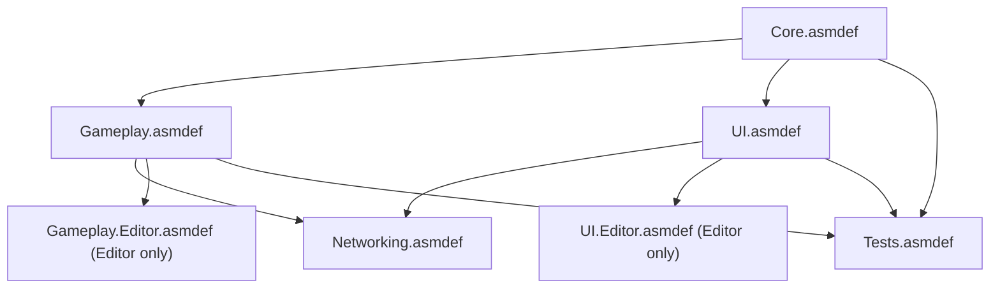
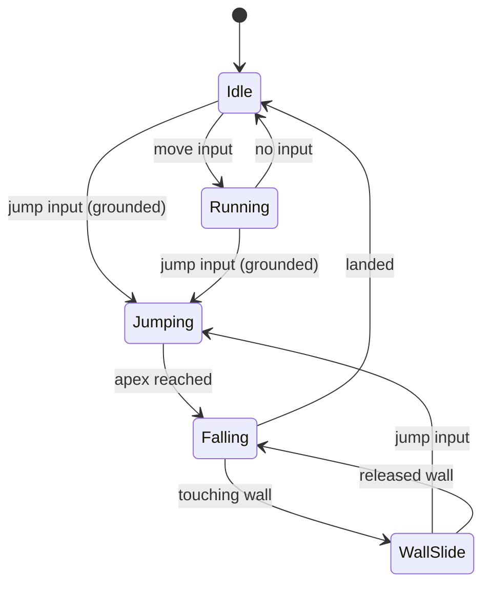
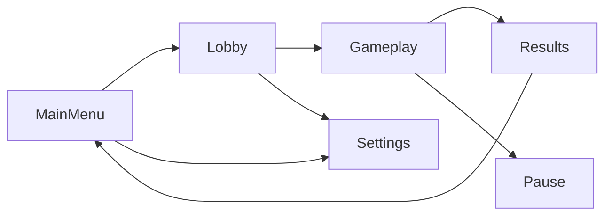

# Technical Design Document

> **How to use this template**: Work through each section during Phase 2 (Technical Design). Claude Code will ask about your technical requirements and help you make informed architectural decisions. Reference `ProjectConfig.yaml` for context.

---

## 1. System Architecture

> **Diagramming**: Use [Mermaid](https://mermaid.js.org) for all architecture diagrams in this document.
> Mermaid renders natively on GitHub and in most IDEs. Claude Code can generate diagrams directly.
> For complex visual exploration, use [Miro](https://miro.com) boards before committing to Mermaid.

### Assembly Definition Graph



### Feature Folder Layout

```
Assets/_Project/Features/{FeatureName}/
├── Runtime/
│   ├── {FeatureName}.asmdef
│   └── *.cs
├── Editor/                              ← Custom Inspectors, Gizmos, tools
│   ├── {FeatureName}.Editor.asmdef      ← References Runtime asmdef, Editor platform only
│   └── *.cs
└── Tests/
    └── {FeatureName}.Tests.asmdef
```

### Dependency Rules
- Dependencies flow **inward** (features → core, never core → features).
- Assemblies should **never** have circular dependencies.
- The `Core` assembly has **zero** external dependencies.

---

## 2. Design Patterns

### Patterns Used

| Pattern | Where | Why |
|---------|-------|-----|
| ScriptableObject Architecture | Data, Events | Decoupled, testable, designer-friendly |
| MVVM | UI (if UI Toolkit) | Clean separation of data and presentation |
| Observer (Event Channel) | Cross-system communication | Loose coupling |
| State Machine | Player controller, AI | Clear state transitions |
| | | |

### State Machine Diagram (example — replace with your own)



> Add a state diagram for each stateful system (player controller, enemy AI, game manager, etc.).
> Use `stateDiagram-v2` for state machines, `classDiagram` for class relationships, `sequenceDiagram` for system interactions.

---

## 3. Data Architecture

### Persistence Strategy
<!-- How is game state saved? PlayerPrefs, JSON, binary, cloud? -->

### ScriptableObject Usage

| SO Type | Purpose | Example |
|---------|---------|---------|
| Data Container | Static game data | `WeaponData`, `EnemyData` |
| Event Channel | Cross-system events | `PlayerDeathEvent` |
| Runtime Set | Live object tracking | `ActiveEnemySet` |

---

## 4. UI Architecture

### UI System
<!-- UIToolkit | UGUI | Mixed — match ProjectConfig -->

### Screen Flow



### UI Data Binding (if UI Toolkit)
<!-- MVVM pattern with [CreateProperty] and DataBinding -->

---

## 5. Networking Architecture

### Network Model
<!-- Server-authoritative | Peer-to-peer | None -->

### Authority Matrix

| Entity | Owner | Read | Write | Sync Method |
|--------|-------|------|-------|-------------|
| | | | | |

### Network Flow

```
Client Input → Server Validation → State Update → Client Sync
```

---

## 6. API Constraints

### Allowed APIs

| Package | Version | Key APIs |
|---------|---------|----------|
| Input System | | `InputAction`, `PlayerInput` |
| Cinemachine | | `CinemachineCamera` |
| | | |

### Denied APIs

| API | Reason | Alternative |
|-----|--------|-------------|
| `GameObject.Find()` in Update | Performance | Cache in Awake |
| `Debug.Log` | Ships in release | `GameDebug` wrapper |
| Legacy Input | Deprecated | New Input System |

---

## 7. Performance Targets

| Metric | Target | Platform |
|--------|--------|----------|
| Frame Rate | 60 FPS | Desktop |
| Frame Rate | 30 FPS | Mobile |
| Memory | < 2 GB | Desktop |
| Load Time | < 5s | All |
| Draw Calls | < 200 | Mobile |

---

## 8. Editor Tooling

<!-- List planned custom tools. Build these alongside features using the unity-editor-tools skill. -->

| Feature | Tool Type | Purpose |
|---------|-----------|--------|
| <!-- e.g. Board --> | <!-- Custom Inspector --> | <!-- Visualize grid, edit cell types --> |
| <!-- e.g. Patrol Path --> | <!-- Handles + Gizmos --> | <!-- Drag waypoints in Scene view --> |
| <!-- e.g. Level Data --> | <!-- EditorWindow --> | <!-- Batch validate all levels --> |

> **Skill**: Use `uw-unity-editor-tools` skill to generate these tools.

---

## 9. Third-Party Libraries

| Library | Version | Purpose | License |
|---------|---------|---------|---------|
| | | | |

---

## 10. Open Technical Questions

1. 
2. 
3. 
